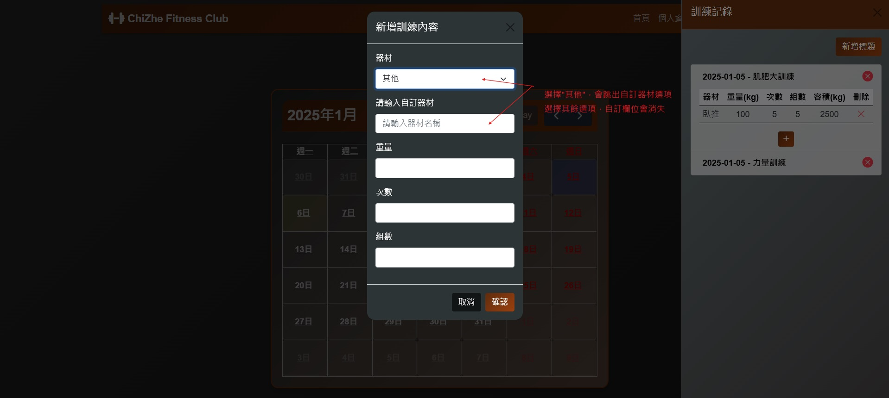

# ChiZhe Fitness Club

## 專案說明

 **健身紀錄系統**
本專案的初衷是為了複習 **Spring Boot**，有段時間沒寫快忘光了。同時，由於有在健身，於是就開發一個符合自身需求的健身紀錄系統。


此專案採用以下技術：
- **後端**：Spring Boot + JPA
- **前端**：Vue.js + FullCalendar
- **資料庫**：Microsoft SQL Server

### 功能概述
1. 使用者登入、註冊功能，使用Spring Security。
2. 更改密碼需要先輸入原密碼才能修改。
3. 可新增訓練標題與訓練內容。
4. 以日曆的方式標記訓練過的日期，顯示不同顏色。
5. 自動計算每月運動天數，顯示在首頁
6. 自動計算每月運動容積公斤數，顯示在首頁
7. 自動計算每週運動容積，並用折線圖顯示  

---

## 架構說明
```plaintext
src/
 └── main/
     ├── java/                        # 後端 Java 程式碼
     │   ├── config/                  # Spring Security設定
     │   ├── controller/              # RESTful API 控制層
     │   ├── exception/               # 使用全域例外處理API
     │   ├── model/
     │   │   ├── bean/                # 資料表對應的實體類
     │   │   ├── service/             # 業務邏輯
     │   │   ├── repository/          # 資料庫邏輯
     │   │   └── dto/                 # 封裝前後端資料傳輸的物件
     ├── resources/                   # 資源檔案
     │   ├── db/                      # 資料表結構
     │   └── static/                  # icon
     └──webapp/                       # 前端網頁

```


## 操作說明與功能
1. 輸入 http://localhost:8080/login.html 登入畫面


2. 點選註冊(必填欄位)


3. 點選註冊(非必填欄位)


4. 進入首頁後可查看統計，使用Chart.js生成折線圖


5. 個人資料區，可修改基本資料或密碼


6. 訓練紀錄區




7. 回到首頁可查看即時更新資料


8. 切換裝置設定


